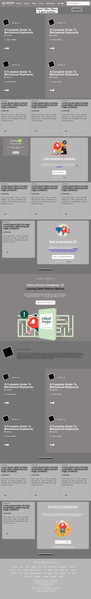

# Desing and Tear Down/Samuel&Juan
 This project consists of building a heatmap of the Smashing magazine website.

> We created a the skeleton of the smashing_magazine

Additional description about the project and its features.

## Built With

- HTML,
- CSS,
- FONTAWESOME

## Live Demo

[Live Demo Link](https://raw.githack.com/SigmaSam/Desing-and-Tear-Down-Samuel-Juan/DesingSmash/index.html)

## Getting Started

To get a local copy up and running follow these simple example steps.

### Open a web browser

### Visit Repository

### Download Repository (https://biodunjohnson.github.io/youtube-frontpage/)

### Run index.html file (into folder html)

## Authors

?? **Juan Jacobo Hincapie Montes**

- Gmail: [@gmail](jacobo12.montes@gmail.com)
- Github: [@githubhandle](https://github.com/jacobo12montes)
- Twitter: [@twitterhandle](https://twitter.com/HincapieMontes)
- Linkedin: [linkedin](https://www.linkedin.com/in/juan-jacobo-hincapi%C3%A9-montes-93975210b/)

## ?? Contributing

Contributions, issues and feature requests are welcome!

Feel free to check the [issues page](https://github.com/SigmaSam/Desing-and-Tear-Down-Samuel-Juan).

## Show your support

Give a ?? if you like this project!

## Acknowledgments

- Hat tip to anyone whose code was used
- Inspiration
- etc

## ?? License

This project is [MIT](lic.url) licensed.

